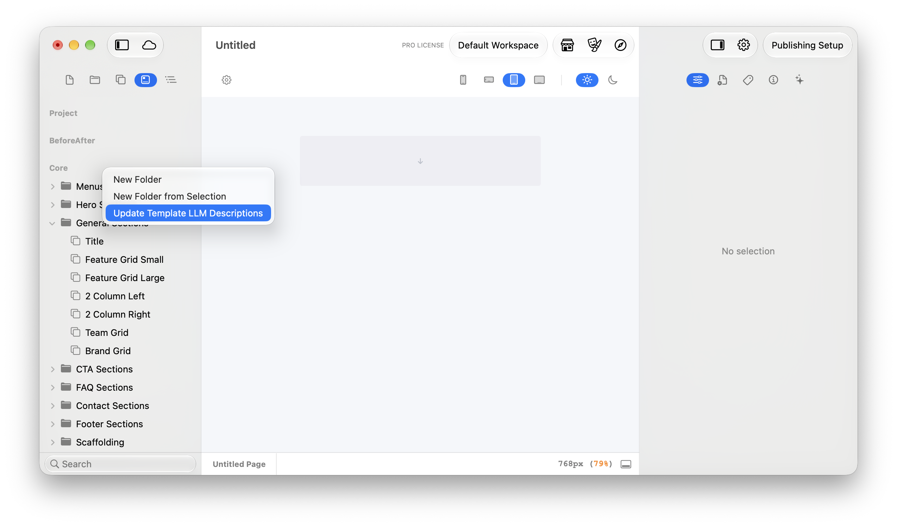
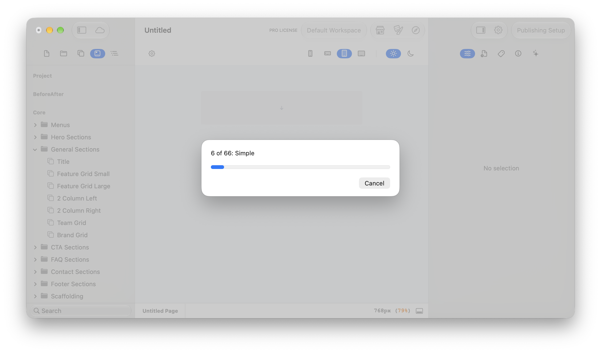

# What are Templates?


**Templates** here means ready-made page sections users insert from the Templates browser — for a component's `templates/` directory see [Component Templates](../component/templates/README.md).


Templates are pre-built page sections — a hero, a feature grid, a menu bar — assembled from components with all their property values already dialled in. An Element Pack can ship them alongside its components, and users insert them from the Templates browser to get a finished, styled section in one drop instead of assembling it component by component.

Unlike components, templates are not hand-coded. You build the section on the canvas in Elements, then save it into your pack — Elements serialises the whole arrangement for you. That's why the [Element Pack overview](../element-pack/what-is-an-element-pack.md) recommends creating templates (like resources and themes) inside the Elements app rather than in an editor.

## Where Templates Live in a Pack

A pack that ships templates carries two things at its root: a `templates/` directory of template folders, and a `templates.json` manifest describing how they appear in the browser. This is the real layout of the open-source Core Pack:

```
Core.elementsdevpack/
├── info.json
├── templates.json                                    # Manifest: the tree shown in the Templates browser
└── templates/
    ├── 10DFAB6B-4F4F-408B-8EB4-4D8DA58E7988/         # One folder per template, named by its identifier
    │   └── template.json                             # Serialised snapshot of the section
    └── 0577D11D-F3CA-43BD-84A5-923A35F7782B/
        ├── template.json
        └── 04D32224-016A-4D8F-A063-E09D37DFC9E9.svg  # A resource bundled with this template
```

## The templates.json Manifest

`templates.json` defines the folder tree users see in the Templates browser. It is a nested structure of nodes, where every node has a `title`, a unique `identifier`, a `kind` of either `{"folder": {}}` or `{"item": {}}`, a `children` array, and an `expanded` flag. Folder nodes have `"item": null`; item nodes carry an `item` object whose `itemIdentifier` names the matching folder inside `templates/`. Here is one branch of the Core Pack's manifest, trimmed to a single child:

```json
{
  "title": "Hero Sections",
  "identifier": "5A0D029E-9272-4DF7-8AEA-5E9AFC70D0C6",
  "kind": { "folder": {} },
  "item": null,
  "expanded": false,
  "children": [
    {
      "title": "Simple",
      "identifier": "849B4497-7FE4-4D68-8D23-791DC41EE5B5",
      "kind": { "item": {} },
      "expanded": false,
      "item": {
        "kind": "prefab",
        "itemIdentifier": "10DFAB6B-4F4F-408B-8EB4-4D8DA58E7988",
        "id": "EE9577BE-239F-4B8D-AC95-BB961283C1E6"
      },
      "children": []
    }
  ]
}
```

Follow that `itemIdentifier` and you land on `templates/10DFAB6B-4F4F-408B-8EB4-4D8DA58E7988/template.json` — the "Simple" hero itself.

## Inside template.json

Each `template.json` is a machine-generated snapshot of the section as it stood when it was saved: its `title` and `identifier`, a `_rootNode`, and an `_allNodes` map holding every component instance in the section — each node records which component it is (its `elementId`, such as `com.realmacsoftware.flex`), its parent, and the full set of property values the designer chose. Alongside those sit `_globals`, `_customComponents`, and a `_resources` array. These files are written by Elements when you save a template; treat them as generated output, not something to author or edit by hand.

## Generate LLM Descriptions for AI

Template names and categories do not always give an AI enough information to choose between similar variants. An LLM description adds context about a template's purpose, layout, notable features, and responsive behaviour so the Elements AI Assistant and connected MCP clients can select a more appropriate template.

Elements can generate or refresh these descriptions across an entire Template DevPack:

1. Add an API key in **Settings > AI > API Keys**.
2. Open the **Templates** tab.
3. Find the heading for your Template DevPack.
4. Right-click the heading and choose **Update Template LLM Descriptions**.

<figure><figcaption><p>Right-click the Template DevPack heading and choose <strong>Update Template LLM Descriptions</strong>.</p></figcaption></figure>

5. Leave Elements running while the AI reviews the templates and updates their descriptions.

The command processes every template in the DevPack one at a time. This can take quite a while for a large library, so leave Elements open until the progress window completes.

<figure><figcaption><p>Elements shows which template it is processing and the overall progress. Large Template DevPacks may take quite a while to finish.</p></figcaption></figure>

Review the resulting DevPack changes before shipping an update.

This lets you keep concise names in the Templates browser while giving AI clients richer information for finding and applying the right template. Elements manages the generated metadata, so you do not need to hand-author private description fields inside `templates.json` or each `template.json`.


If **Update Template LLM Descriptions** is not in the context menu, the installed Elements build does not yet include this feature. Update to a newer build when one is available.


## Templates and Resources

Templates are self-contained. If a section uses an image or an SVG, the file is bundled inside the template's own folder — named by its resource identifier — and catalogued in the `_resources` array of `template.json`, which records metadata such as the resource's `identifier`, `name`, and type. The Core Pack's "List Item" template, for example, ships a `check.svg` right beside its `template.json`, so the section renders complete wherever it is inserted.

## Templates-Only Packs

A pack doesn't need components at all. The "Core Templates v2" pack ships nothing but a `templates/` directory, its `templates.json`, and a `resources.json` — its `info.json` simply declares `"categories": ["templates"]`. If your product is a library of ready-made sections, this is all the structure you need.

## Related Documentation

* [What is an Element Pack?](../element-pack/what-is-an-element-pack.md)
* [What are Resources?](../resource/what-are-resources.md)
* [What is a Component?](../component/components.md)
* [Component Templates](../component/templates/README.md)
